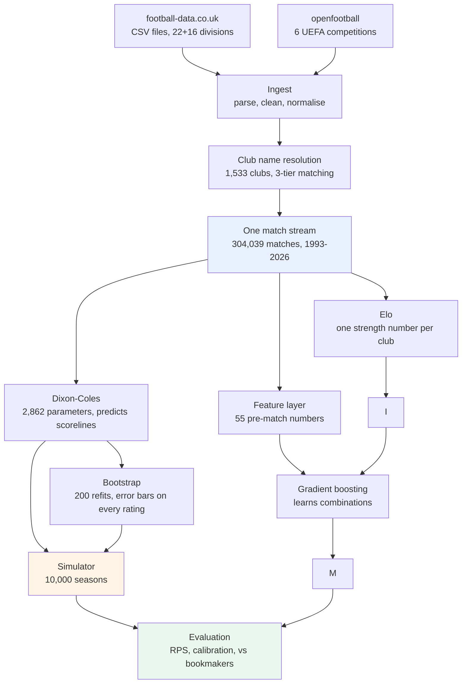
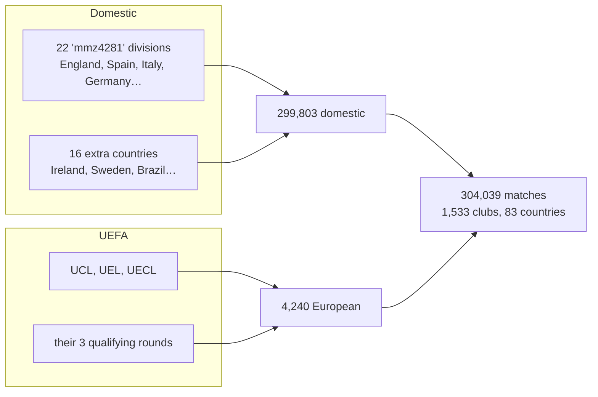
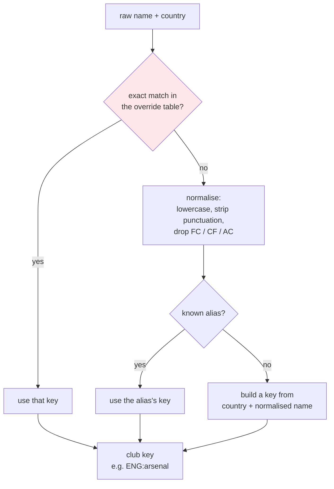
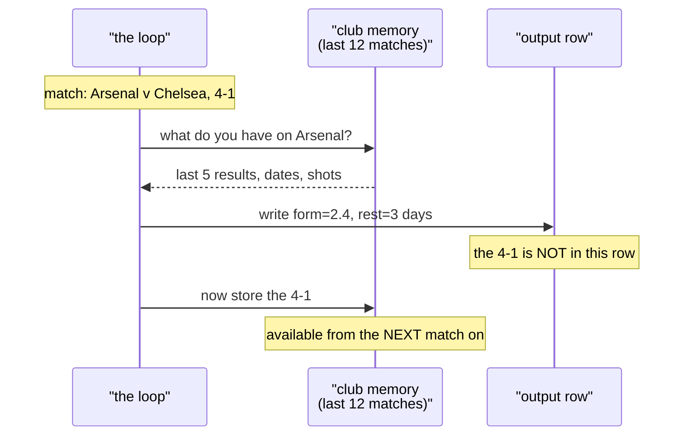
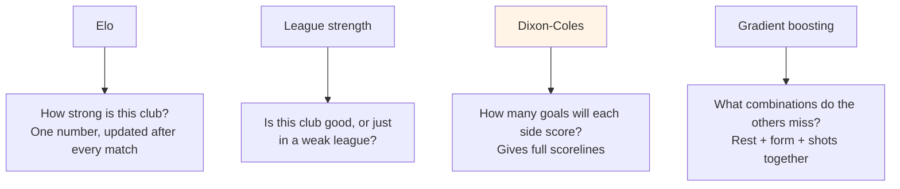
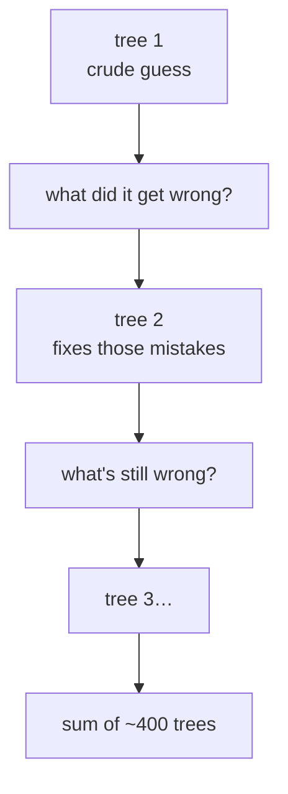
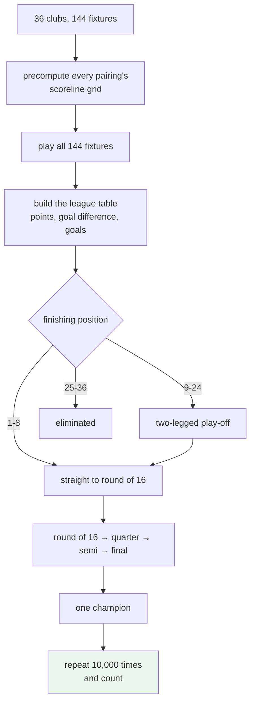
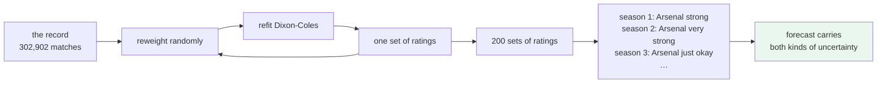
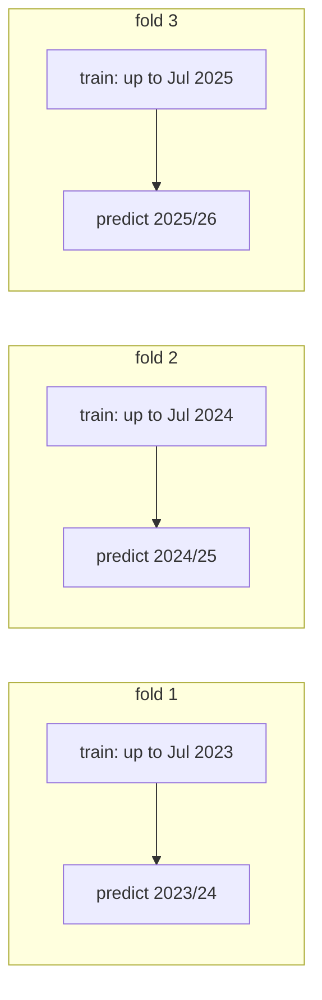
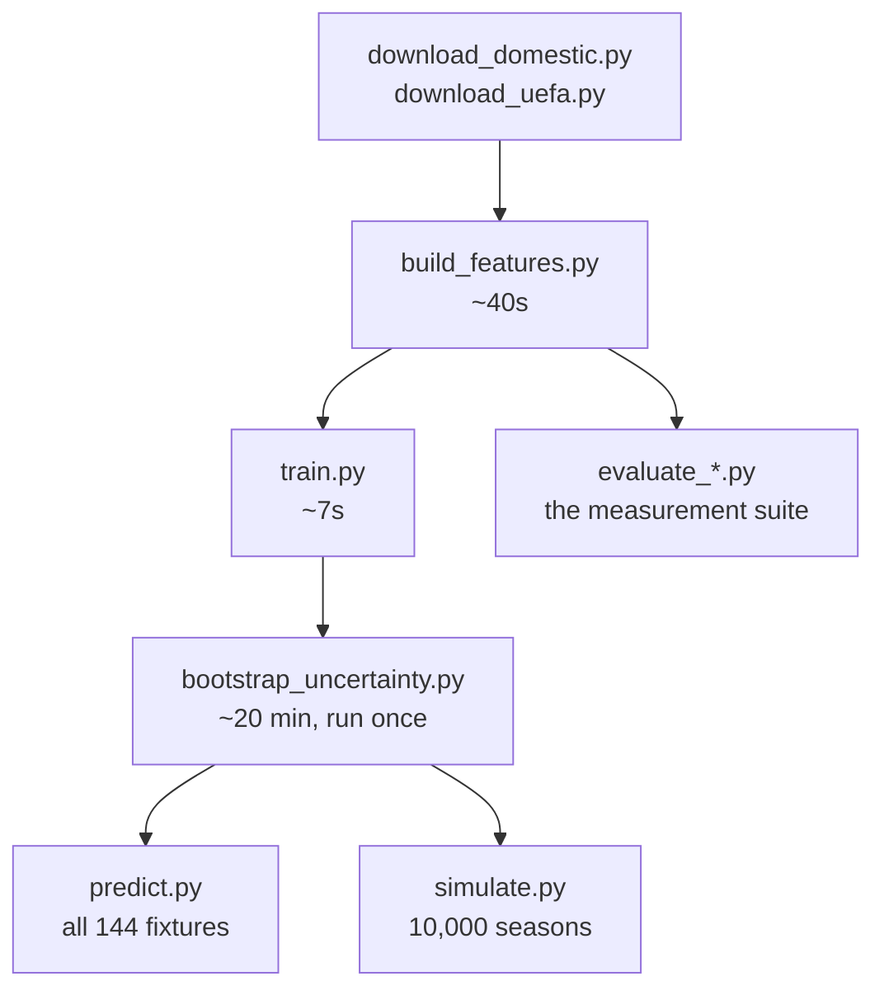

# PitchIQ — how the whole thing is built

A forecasting engine for the UEFA Champions League. It reads three
decades of football results, learns how good every club is, and plays
the 2026/27 tournament ten thousand times to work out who is likely to
win.

This document explains every part and why it exists. No prior knowledge
assumed.

---

## 1. What the program actually does

Give it two clubs and it answers with percentages:

> Arsenal vs Tottenham → **Arsenal 75.7%**, draw 15.7%, Tottenham 8.5%

Then it takes all 144 Champions League fixtures, plays the whole season
ten thousand times, and counts how often each club finishes where.

> Arsenal: **top 8 in 34%** of seasons, **wins it in 20.4%**

That is the product. Everything else in this document is the machinery
that produces those two kinds of statement.

---

## 2. The pipeline, end to end



Read it as three stages:

1. **Get the data into one shape** (top third)
2. **Learn from it** (middle)
3. **Simulate and check the answer is honest** (bottom)

---

## 3. The data layer

### Where the matches come from

| Source | What it gives | How much |
|---|---|---|
| football-data.co.uk | Domestic league results, plus shots, cards, corners and **bookmaker odds** | 299,803 matches |
| openfootball | All six UEFA competitions | 4,240 matches |

Both are free and downloadable. Nothing is scraped, no API key is
needed, and no paid provider is involved.



### Why the domestic leagues matter so much

The Champions League on its own is only about 4,000 matches, spread
across clubs that rarely meet twice. That is far too thin to learn from
— you would be estimating a club's strength from six games.

So the engine learns from **domestic football**, where clubs play each
other constantly, and carries those ratings into Europe. The European
matches are what stitch the leagues together: when an Italian club
plays a Portuguese one, that result tells us how the two leagues
compare.

### The problem nobody warns you about: names

The same club is written differently in different files.

```
"Man United"  "Manchester United"  "Manchester Utd"  "Man Utd"
```

If those become four separate clubs, every rating is wrong and nothing
downstream can be trusted.

The fix is a three-tier resolver. **It never guesses.**



The **override table exists because normalising is dangerous.**
Stripping a founding year from a name merges clubs that are genuinely
different:

```
"U Craiova"   and  "U Craiova 1948"    -> different clubs
"Granada"     and  "Granada 74"        -> different clubs
"Wimbledon"   and  "AFC Wimbledon"     -> different clubs
```

Those three were real bugs, caught by a test that scans all 300,000
names looking for silent merges. **Fuzzy matching is never used** —
it would create exactly this class of error and hide it.

---

## 4. The feature layer

### The problem

The models could only see four things:

```
home team, away team, goals, date
```

Nothing about form, fatigue, or whether a team is creating chances and
missing them.

### What was added

55 numbers per match, all of them things you could have known **before
kick-off**.

| Group | Examples |
|---|---|
| Form | points per game over the last 3, 5, 10 matches |
| Goals | scored and conceded over the last 5, 10 |
| Venue | home team's home record; away team's away record |
| Fatigue | days since last match; matches in the last 14 days |
| Chances | shots and shots on target, for and against |
| History | head-to-head over the last 5 meetings |
| Ratings | Elo, and Elo's expected score |
| Context | competition tier, European or not, knockout or not, month |

### The one thing that could ruin all of it

**Leakage** — a feature that accidentally contains information from
after the match.

It is catastrophic *and* invisible. Scores improve, everything looks
brilliant, and the model is worthless on anything real.

The usual approach is a rolling window with a `shift`, and hoping the
shift is right. That was rejected. Instead the code walks the fixture
list in date order holding per-club memory, and for each match does
exactly two things **in this order**:



A match cannot see itself, because its result has not reached the
memory when its row is written. It cannot see later matches, because
they have not happened yet in the loop.

**The property is structural, not a rule someone has to remember.**

It is tested anyway: change any match's result to 9–0, rebuild, and
assert that no feature at or before that match moves. Plus the mirror
test — changing a result *must* change the next row, otherwise code
returning all zeroes would pass perfectly.

**Cost:** 40 seconds instead of 3. Worth it for a property that cannot
be quietly broken by a later edit.

---

## 5. The models

Four models, each answering a different question.



### Elo — one number per club

Everyone starts at 1500. Win, and you take points from your opponent.
Lose, and you give them up. Beat a stronger side and you gain more.

Two football-specific adjustments: the home side gets a bonus of about
65 rating points before the match is scored, and a bigger winning
margin moves the ratings further.

**Score: 0.2099** *(lower is better — see §8)*

### League strength — the "big fish, small pond" fix

Elo alone had Celtic as the 12th best club in Europe. They dominate
Scotland, so they accumulate rating — but Scottish football is weaker
than the leagues Celtic's rating implied.

The first attempt shifted every Scottish club down by a fixed amount.
**It failed**, and the reason is worth understanding: shifting a whole
league preserves the gaps inside it, so Celtic still towered over
everyone.

The fix adds a **scale** as well as a shift:

```
adjusted = league average + scale × (rating − league average) + shift
```

A scale below 1 squeezes a league's internal spread. Scotland fitted to
scale 0.76, shift −126. Celtic went from 12th to 84th.


**Score: 0.2052** — a real improvement, confirmed statistically.

### Dixon-Coles — the one that predicts scorelines

Published in 1997 and still the standard. It gives every club two
numbers:

```
Arsenal   attack +1.04   defence -0.31
```

From any two clubs it computes expected goals for each side, then a
full grid of scoreline probabilities — 2–1, 0–0, 3–2 and so on.

Two refinements over plain Poisson:

- **A low-score correction.** Real football has more 0–0s and 1–1s than
  independent Poisson predicts. One extra parameter fixes it.
- **Time decay.** A match from 2015 counts less than one from last
  month.

**2,862 parameters, fitted in about 7 seconds** using analytic
gradients. Without them the optimiser would need roughly 738,000 passes
over the data.

**This model cannot be removed.** It is the only one producing
scorelines, and the league phase is decided on goal difference.

**Score: 0.2054 on European matches — the best of any model there.**

### Gradient boosting (XGBoost) — the combinations finder

Not a downloaded brain. A **blank algorithm** that learns from our data
and nothing else.

It builds a small decision tree, sees where it was wrong, builds
another tree to fix those mistakes, and repeats a few hundred times.



What it adds that the others cannot express: *"a short rest hurts, but
only after a European away leg."* A formula cannot say that. Two nested
tree splits can.

**Score: 0.2085 — best on domestic football.** In Europe it does not
beat Dixon-Coles.

Its most-used inputs, by importance:

```
elo_diff           206     ← dominates
elo_expected       122
form over 10          23
form over 3           17
shots on target       13     ← the previously unused data earns its place
rest days              9
```

Read honestly: **it is "Elo, with small corrections."**

---

## 6. The simulator

### Playing a season ten thousand times



Takes **0.6 seconds** for 10,000 seasons. The trick is precomputing
every ordered pair's scoreline distribution once, then sampling from
them, instead of recomputing probabilities inside the loop.

The bracket was verified against reality: in 2024/25 PSG finished 1st
and met Aston Villa (8th) in the quarter-final, which is exactly what
the implemented bracket produces.

### Parameter uncertainty — the honesty fix

The version above has a flaw. **It treats the ratings as facts.**

Arsenal's attack is 1.04 in all 10,000 seasons. So is the rating of a
club we have seen 22 times. The simulator never entertains the
possibility that we have simply misjudged a team.

Think of two penalty takers:

| | penalties taken | scored | rating |
|---|---|---|---|
| Player A | 100 | 80 | 80% |
| Player B | 5 | 4 | 80% |

Same number. Completely different confidence. The old simulator treats
both as exactly 80%, every single time.

**The fix:** refit the model 200 times on reweighted copies of the
record, and let each simulated season draw a different set of ratings.



Now the 10,000 seasons capture **both** sources of variation: luck
inside the matches, *and* the chance we have the team wrong. A club
seen 238 times barely wobbles. One seen 22 times wobbles a lot.

The spread it finds lands exactly where it should:

```
Manchester City   attack 1.149  ± 0.038
Bayern Munich     attack 1.244  ± 0.040
Shakhtar Donetsk  attack 0.382  ± 0.139
Sabah             attack 0.271  ± 0.243     ← 6× wider
```

### Did it work?

Same 1,448 club-seasons, same fixtures, same seed. The only difference
is fixed versus drawn ratings.

| | fixed | sampled |
|---|---|---|
| slope (1.000 is calibrated) | 0.856 | **0.884** |
| 90% interval coverage | 89.6% | **90.7%** |
| coverage, clubs predicted top 3 | 85.9% | **92.2%** |

```
paired change in slope +0.0274   95% CI [+0.0225, +0.0327]   significant
```

**Yes, and it aimed correctly** — nearly all the improvement landed in
the favourites band, which is where the problem was. The 90% interval is
now honest.

**But it closes 19% of the gap, not all of it.** The bootstrap captures
*"we may have measured this club wrong."* It cannot capture *"this club
changed over the summer"* — transfers, managers, rebuilds — and that is
most of what remains.

### The prediction that was wrong

It was expected that Arsenal's title chance would fall from 20.4% to
around 17%. It did not:

| | fixed | sampled |
|---|---|---|
| Arsenal wins it | 20.4% | 20.5% |
| top six combined | 78.9% | 77.8% |
| Barcelona top 8 | 55.1% | **52.3%** |
| Manchester City top 8 | 63.6% | **61.8%** |
| Sabah top 8 | 0.0% | 0.15% |

The reason is in the spreads above: **the contenders have the tightest
error bars of anyone.** We have seen Manchester City hundreds of times;
their rating is not in doubt. The uncertainty sits with clubs that have
no title chance either way.

And winning the competition means surviving four knockout ties — already
close to four coin flips. Rating uncertainty adds little on top of
randomness that large.

So the effect appears on **qualification**, where a single season's
spread of results decides things, and washes out by the trophy.

---

## 7. How the work is validated

Everything is measured **walk-forward**: train on the past, predict the
future, roll forward. Never a random split — that lets a model learn
from matches that had not happened yet.



**Every model refits at every fold.** This matters more than it sounds.
An early version compared a model refitted yearly against one frozen
for three years, and the result — boosting ahead by 0.0084 — was
measuring *which model had seen more recent football*, not which model
was better. Refitting both properly cut the gap to 0.0055.

**Every comparison ships with a confidence interval**, from a paired
bootstrap. Without one, "0.2085 against 0.2092" says nothing about
whether the gap would survive a different set of matches. This
machinery has overturned four claims, including two made in the course
of building it.

---

## 8. The scoring rules

Three measures, each catching something the others miss.

**RPS (ranked probability score)** — the main one. Lower is better,
0 is perfect. It respects order: saying "home win" when the away side
won is punished more than saying "draw".

**Brier score** — same idea, but treats the three outcomes as unrelated
labels. Blunter, but it separates cleanly into calibration and
resolution.

**Calibration** — *when we say 70%, does it happen 70% of the time?*
A model can rank matches perfectly and still overstate every number it
prints. That would score well on anything about ordering and be useless
for anything that acts on the number itself — like a simulator that
multiplies probabilities across a whole season.

---

## 9. Results

### Match forecasting, 37,765 held-out matches

```
knowing nothing        0.2282
dixon-coles            0.2141
elo                    0.2099
gradient boosting      0.2085   ← our best
bookmaker closing line 0.2036
```

**We cover about 80% of the distance from ignorance to the
professionals**, using only past results and dates.

### European matches only (1,359)

```
dixon-coles            0.2054   ← best here
gradient boosting      0.2085
elo                    0.2092
```

On the matches that actually matter, no model is statistically
distinguishable from another. 1,359 matches cannot separate forecasts
that differ by 0.003, and pretending otherwise would be dishonest.

### Against the bookmakers

The important question is not "who is better" but **"do we know
anything they don't?"** If we do, mixing the two should beat either
alone.

We tested it three ways:

- **Linear blend** — the best mix put **0% weight on our model**, in all
  three folds. Every drop of our forecast made it worse.
- **Log-odds stacking**, a method that can pick and choose — gained
  0.00009 RPS. Statistically indistinguishable from zero.
- **By division** — no soft spot. Fifth-tier English football is priced
  about as sharply as the Premier League.

**Conclusion: we carry no information the closing line lacks.** The
missing piece is team news — injuries, suspensions, lineups — which the
market has and we do not.

That is a data problem, not a modelling problem. More clever modelling
will not close it.

### Calibration

```
model            RPS    Brier     ECE   over-confidence
elo           0.2099   0.3059  0.0063          +0.0104
dixon_coles   0.2141   0.3101  0.0033          +0.0060
boosting      0.2085   0.3045  0.0058          +0.0096
market        0.2036   0.2995  0.0068          -0.0079
```

**Dixon-Coles is better calibrated than the bookmakers** (0.0033
against 0.0068). When it says 70%, it means 70%.

### Where it does go wrong

Per match we are honest. Across a whole season we are not.

Testing the simulator on **4,225 real club-seasons** — every complete
domestic league season since 2015 — and regressing where clubs actually
finished against where we predicted:

```
actual = 0.828 × predicted        95% CI [0.799, 0.858]
```

A calibrated forecast gives **1.000**. We get **0.828**.

Plain English: **our predictions are about 21% more spread out than
reality justifies.** We push good teams too far up the table and bad
teams too far down.

```
predicted position    mean error
      1-3               +0.79    finish lower than we said
      3-6               +1.00
      6-10              +0.48
     10-14              +0.03
     14-25              -1.29    finish higher than we said
```

The errors cancel to zero overall — but only because the two extremes
are wrong in *opposite* directions. That is the signature of predictions
spread too wide.

Sampling the ratings (§6) moves the slope to **0.884** and brings 90%
interval coverage to **90.7%**. The remainder is squad change between
seasons, which no amount of resampling the past can capture.

---

## 10. Running it



| Script | What it does |
|---|---|
| `download_domestic.py` | Fetch football-data.co.uk CSVs |
| `download_uefa.py` | Fetch openfootball results |
| `build_features.py` | Build the 55-feature table |
| `train.py` | Fit Dixon-Coles and save it |
| `bootstrap_uncertainty.py` | 200 refits, error bars on every rating |
| `predict.py` | Forecast all 144 fixtures |
| `simulate.py` | Play the tournament 10,000 times |
| `evaluate_features.py` | Do the features beat Elo alone? |
| `evaluate_boosted.py` | XGBoost against Dixon-Coles |
| `evaluate_market.py` | Model against the bookmakers |
| `evaluate_calibration.py` | Are the probabilities honest? |
| `evaluate_simulator.py` | Are the season-long ranges honest? |
| `evaluate_uncertainty.py` | Did sampling the ratings fix it? |

---

## 11. The code

```
pitchiq/
  clubs.py              name resolution, 3 tiers, no fuzzy matching
  matches.py            one stream, every source, one set of columns
  config.py             paths and secrets; nothing else reads .env
  ingest/
    football_data_uk.py 22 + 16 divisions, 3 column vocabularies
    openfootball.py     6 UEFA competitions, scoreline parsing
  features/
    rolling.py          the causal pass — leakage impossible by design
    build.py            assembles rolling + Elo + context
  models/
    elo.py              sequential ratings
    league_strength.py  per-country scale and shift
    dixon_coles.py      2,862 parameters, analytic gradients
    boosted.py          XGBoost over the feature layer
    ensemble.py         blends outcomes, keeps DC's scorelines
    uncertainty.py      bootstrap: error bars on every rating
    shots.py            shot ratings as a prior (tested, rejected)
    outcome.py          rating difference → three probabilities
    store.py            save/load as JSON, with provenance
  sim/
    tournament.py       the Champions League bracket
    league.py           a domestic season, for validation at scale
    draws.py            spreads seasons across parameter draws
    rules.py            competition format, versioned by season
  eval/
    metrics.py          RPS, log-loss, Brier, accuracy
    calibration.py      reliability curves, over-confidence
    market.py           bookmaker odds — evaluation only, never a feature
    backtest.py         the walk-forward pass, cached
```

**5,400 lines. 210 tests.**

### One deliberate structural choice

**Bookmaker odds live in `eval/`, not in `features/`.**

If a price ever became a model input, the trees would learn to copy it.
The backtest would look superb and the model would be worthless on any
fixture nobody priced — which includes every Champions League match we
have. There is a test asserting the odds columns appear in no feature
list.

---

## 12. What we know is missing

**Team news.** Injuries, suspensions, lineups, who is being rested.
This is essentially the entire remaining gap to the bookmakers. FBref is
Cloudflare-blocked and its terms forbid automated access; no free lineup
source was found. **Blocked on data availability, not on code.**

**No European odds.** football-data.co.uk prices domestic leagues only.
So the "we know nothing the market doesn't" finding is a *domestic*
finding. How we compare to the market on Champions League football is
untested and untestable with what we have.

**Promoted clubs.** A club Dixon-Coles has never rated is treated as
exactly league-average. Their interval coverage is 79% against 89% for
rated clubs. Small sample, obvious cause, cheap fix.

**Rating staleness.** Russian clubs have been in a closed league since
2022, accruing rating without ever being tested against outside
opposition. Russia is the visible case; the general one is any club
whose rating has not met foreign opposition recently.

**Domestic validation is the easy case.** The 4,225 club-seasons behind
the calibration work are leagues where clubs meet twice a year and
ratings are settled. European ties are between clubs who rarely play.
Strong evidence, not proof.
